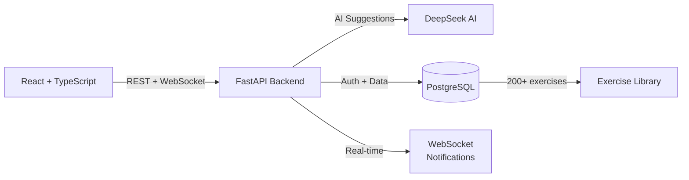

# 🏋️ TrackFitt

> AI-powered fitness platform — smart workout recommendations, real-time tracking, gamified progress.


---

## Architecture



**Full-stack monorepo:**
- **Frontend** → [This repo] React 18 + TypeScript + Material UI
- **Backend** → [TrackFitt-API](https://github.com/abhiFSD/TrackFitt-API) FastAPI + PostgreSQL + DeepSeek AI

---

## Features

### 🤖 AI-Powered
| Feature | Description |
|---------|-------------|
| **Smart Recommendations** | AI generates workout plans based on your fitness level, goals, and history |
| **Exercise Suggestions** | DeepSeek AI recommends exercises tailored to your body metrics and preferences |
| **AI History** | Review all past AI interactions and recommendations |

### 💪 Workout Management
- **200+ Pre-loaded Exercises** — Cardio, HIIT, Pilates, Flexibility, Strength (CSV-seeded)
- **Custom Workouts** — Build and save workout routines from the exercise library
- **Schedule Workouts** — Plan your training week with a workout calendar
- **Real-Time Tracking** — Active workout timer with live set/rep/weight logging
- **Workout History** — Detailed logs of every completed session

### 👤 Comprehensive Profiles
- **Physical Metrics** — Height, weight, body measurements
- **Fitness Data** — Experience level, activity level, personal records
- **Health Data** — Medical conditions, injuries, limitations
- **Goals** — Set and track fitness objectives with deadlines

### 🎮 Gamification
- **Token System** — Earn tokens by completing workouts
- **Token Marketplace** — Request and manage tokens
- **Admin Panel** — Manage users, exercises, and token distribution

### 🔔 Real-Time
- **WebSocket Notifications** — Instant alerts for achievements, reminders
- **Live Sync** — Workout state syncs across devices in real-time

---

## Tech Stack

### Frontend (This Repo)
| Technology | Purpose |
|-----------|---------|
| React 18 + TypeScript | UI framework |
| Material UI v5 | Component library |
| React Router v6 | Navigation |
| Formik + Yup | Form handling + validation |
| Axios | API client |
| WebSocket | Real-time notifications |
| react-body-highlighter | Visual muscle group display |
| date-fns | Date formatting |

### Backend ([TrackFitt-API](https://github.com/abhiFSD/TrackFitt-API))
| Technology | Purpose |
|-----------|---------|
| FastAPI (Python) | API framework |
| PostgreSQL + SQLAlchemy | Database + ORM |
| Alembic | Database migrations |
| DeepSeek + Google AI | Exercise recommendations |
| JWT + bcrypt | Authentication |
| WebSockets | Real-time events |
| Docker Compose | One-command deployment |

---

## Data Models (17 Tables)

```
User → UserProfile → FitnessLevel, ActivityLevel
     → Workout → WorkoutExercise → WorkoutExerciseSet
     → WorkoutHistory → WorkoutHistoryExercise → Sets
     → ScheduledWorkout → ScheduledWorkoutExercise
     → Token → TokenRequest
     → Notification
     → AITracking
Exercise → ExerciseCategory
```

---

## Quick Start

```bash
# Frontend
git clone https://github.com/abhiFSD/TrackFitt.git
cd TrackFitt
npm install
npm start    # → http://localhost:3000

# Backend (separate terminal)
git clone https://github.com/abhiFSD/TrackFitt-API.git
cd TrackFitt-API
docker-compose up -d    # Starts API + PostgreSQL
```

Or run the backend without Docker:
```bash
pip install -r requirements.txt
uvicorn app.main:app --reload --port 8000
```

---

## Project Structure

```
src/
├── pages/                    # 17 app pages
│   ├── DashboardPage         # Main dashboard with stats
│   ├── WorkoutsPage          # Workout library
│   ├── WorkoutTrackerPage    # Active workout tracking
│   ├── ExercisesPage         # Exercise browser
│   ├── ProfilePage           # Multi-step profile setup
│   ├── AiHistoryPage         # AI recommendation history
│   ├── Admin*Page            # Admin panels (users, exercises, tokens)
│   └── ...
├── components/
│   ├── Layout/               # Navbar, MainLayout
│   ├── Profile/              # 6 profile form sections
│   ├── Notification/         # Real-time notification bell
│   └── common/               # Shared UI (cards, modals, grids)
├── context/                  # Auth, Theme, Workout, Notifications
├── services/api.ts           # 57 API endpoint bindings
└── utils/                    # Theme config, date helpers
```

---

## API (57 Endpoints)

The backend exposes 57 RESTful endpoints + WebSocket:

**Auth:** Register, Login, Token refresh
**Exercises:** CRUD + categories + search + AI suggestions
**Workouts:** Create, edit, schedule, track, complete
**History:** Log completed workouts with detailed sets/reps
**Tokens:** Earn, request, admin distribution
**Profile:** Multi-section profile with fitness/health data
**Notifications:** Real-time via WebSocket
**Admin:** User management, exercise management, token management

---

## License

MIT
